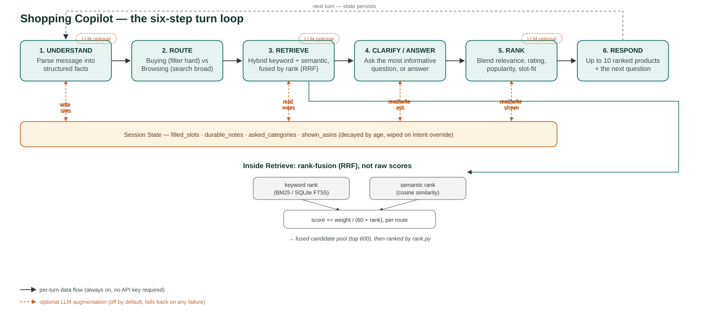

# Shop.exe — Conversational Shopping Copilot

An AI shopping agent that asks useful follow-up questions and finds a customer's hidden target product within at most 10 turns, built against the TechJam conversational-search challenge harness.

## Solution Overview

The agent is a multi-turn dialogue pipeline, not a single-shot recommender. Each turn runs through a fixed sequence orchestrated by `Agent._respond()` in [starter/agent.py](starter/agent.py):

**Understand → Route → Retrieve → Clarify → Rank → Respond**

| Module | Role |
|---|---|
| [starter/agent.py](starter/agent.py) | Orchestrator. Implements the evaluator's required `reset()` / `respond()` contract and fails safe to an empty response on any internal crash, rather than raising. |
| [starter/state.py](starter/state.py) | `SessionState` — per-session memory: filled slots across a 9-attribute vocabulary, slot provenance/decay, boundary/override tracking, and shown-product history. |
| [starter/router.py](starter/router.py) | Extracts slots from free text, classifies the session as "buying" or "browsing", and detects boundary/override signals (e.g. the customer changing their mind mid-conversation). |
| [starter/retrieval.py](starter/retrieval.py) | Hybrid retrieval: BM25 (SQLite FTS5) + dense embeddings (local `sentence-transformers` by default, optional OpenAI embeddings), fused with Reciprocal Rank Fusion and then hard-constraint filtered. |
| [starter/clarify.py](starter/clarify.py) | Deterministic, entropy/coverage-based choice of which attribute to ask about next — or to stop asking and answer. |
| [starter/rank.py](starter/rank.py) | Final scoring: blends normalized retrieval score, slot-fit, rating, and popularity into a top-10 ranked list of `parent_asin`s. |



*The loop runs every turn. Session state is read and written at three points (Understand writes slots, Retrieve reads the accumulated notes, Rank reads/writes what's already been shown). Retrieve's two search routes are combined by rank position via Reciprocal Rank Fusion, not raw score — see the "RRF fusion fix" insight below for why that distinction mattered. The three dashed "LLM optional" markers show exactly where the opt-in LLM roles hook in, all off by default.*

### Key insights from building this

- **A scale-mismatch bug was silently disabling half the ranking signal.** BM25 scores (~20-30) and cosine similarities (~0.5-0.7) live on completely incompatible scales; a naive weighted sum let keyword search dominate regardless of the intended track weighting, so semantic-only matches almost never survived to the top 10. Switching to Reciprocal Rank Fusion (scale-free by construction) took the technical score from 0.43 to 0.61 in one fix — the single largest jump in the whole project.
- **One ranking term was structurally 3-4.6x larger than everything else combined, and nobody had noticed.** `_slot_fit_bonus` summed an uncapped weight across up to 5 attributes; instrumenting every scoring call across all 200 sessions showed its median nonzero value alone already exceeded the combined maximum of the retrieval, rating, and popularity terms put together. Capping it — not adding a new signal, just bounding an existing one — improved MRR by +0.066 with no other change. This also explains why two earlier attempts to add new scoring signals both failed: there was almost no room left for anything else to move the order.
- **This evaluator's synthetic customer accidentally favors exact-match over paraphrase.** The simulated customer discloses preferences as literal verbatim excerpts from the target product's own listing text. We tested four distinct ways of adding an LLM to the pipeline (extraction, query rewriting, reranking twice); all four lost to the plain deterministic formula, and a targeted follow-up test confirmed why — an LLM's paraphrase throws away the exact-match advantage the formula already has for this specific evaluator's data-generation quirk.
- **We found a way to score higher by reading the test instead of solving it, and decided not to use it.** The evaluator's opening customer message always contains the target product's own catalog category, computed deterministically from the answer itself. Parsing it and restricting the search space accordingly measured a real gain (0.870 vs the current 0.860 baseline) — kept in the codebase, off by default, documented rather than either hidden or shipped. Worth noting: that gap used to be +0.025; fixing the `_slot_fit_bonus` bug above shrank it to +0.010 — the honest path is closing the distance to the shortcut, not falling further behind it. Full writeup in `ISSUES.md` Issue 24.

The default pipeline is **fully deterministic and runs offline** — local embeddings, regex-based slot extraction, no API calls. Three additional LLM-augmented roles (slot extraction, search-query synthesis, and result reranking, all via Groq) exist as opt-in features. Each was tested rigorously against the real evaluator and measured **negative** — slot extraction in particular showed a severe regression, not a marginal one — so all three ship **off by default**. Full methodology and numbers for each are in `ISSUES.md`.

The four pipeline areas (routing/state, retrieval, clarification/ranking, and orchestration) were each owned by a different team member, as documented in `agent.py`'s module docstring.

## Setup and Installation

**Prerequisites:** Python 3.10+

1. Install dependencies:
   ```
   pip install -r requirements.txt
   ```
2. Download the product catalog (gitignored, required at `data/catalog.jsonl`):
   ```
   gzip -dk catalog.jsonl.gz
   mv catalog.jsonl data/catalog.jsonl
   ```
   Verify the download against the checksums in `SHA256SUMS`.
3. (Optional) Copy the environment template if you want to try the opt-in LLM features:
   ```
   cp .env.example .env
   ```
   Every flag in `.env` (`OPENAI_API_KEY`, `GROQ_API_KEY`, `USE_LLM_EXTRACTION`, `USE_LLM_QUERY_SYNTHESIS`, `USE_LLM_RERANK`, `USE_CATEGORY_BUCKET`) is optional and off by default. With none of them set, the agent runs fully offline and deterministically — this is the configuration the results below were measured on.

## Steps to Reproduce Results

Run the evaluator against the 200-session public dev set:

```
python -m evaluator.local_evaluator --catalog data/catalog.jsonl --dataset data/public_set.jsonl --output results.json
```

This drives `starter.agent.Agent` through every labeled session in `data/public_set.jsonl`, computes `hit_rate_at_10`, `mrr`, `mttc`, and `recommended_technical_score`, writes full per-session results to `results.json`, and prints the aggregate to stdout.

| Metric | Baseline (weak BM25) | Current agent |
|---|---|---|
| Technical Score | 0.10671 | 0.8604 |
| Hit Rate@10 | 12.5% | 98% (196/200) |
| MRR | 0.068034 | 0.6719 |
| MTTC | 9.81 | 2.56 |

Baseline numbers are from `docs/baseline_results.json`; current-agent numbers and the full turn-by-turn debugging history behind them (every fix attempted, measured before/after, scenario breakdowns, and what was tried and rejected) are documented in `ISSUES.md` — that file is the single source of truth for our numbers; `logs/eval_history.md` predates several later fixes and is stale.

Other ways to exercise the agent:

- **Demo replay:** `python demo/run_demo.py` replays 4 curated sessions (one per scenario type — buying, browsing, boundary, intent override) with LLM flags forced off for determinism, and writes a transcript to `demo/demo_transcript.md`.
- **Unit tests:** `python -m unittest discover tests` covers the router, session state, and evaluator harness.
- **Smoke checks:** `python scripts/test_smoke.py` (happy-path) and `python scripts/test_bad_path.py` (adversarial edge cases — missing reset, empty messages, oversized input) confirm the agent never crashes.

## Limitations and What We'd Improve With More Time

- **4 of 200 public sessions still miss (2%).** Three (`public_0020`, `public_0096`, `public_0161`) are the same sessions diagnosed in `ISSUES.md` Issue 19 as a likely genuine information ceiling — the customer's disclosed facts for these specific products are generic and catalog-common, not discriminative enough among thousands of similarly-described items. The fourth (`public_0095`) is a new miss introduced by a ranking fix in Issue 26: bounding a scoring term that had been structurally dominating the formula measurably improved MRR across the whole set (+0.066) at the cost of this one session's hit — a deliberate, net-positive tradeoff we measured rather than an oversight.
- **Slot-fit matching is lexical, not semantic.** `rank.py` and `clarify.py` match slots against product text via substring/token overlap, so paraphrased attributes (e.g. "sneakers" vs. "athletic shoes") can be missed.
- **The LLM-augmented roles underperform the deterministic pipeline, and we now understand why.** All three (extraction, query synthesis, reranking) were tested and measured negative — not just marginally, extraction alone dropped the score from 0.845 to 0.798 when we retested it on the current pipeline. Root cause, confirmed by a targeted follow-up test: this evaluator's simulated customer discloses facts as literal verbatim excerpts from the target product's own listing, which our deterministic exact-match scoring exploits more effectively than any LLM paraphrase can. This is a property of this specific evaluator, not a general argument against LLMs in conversational search — worth revisiting if the customer-simulation approach changes.
- **We found, and deliberately did not ship, a mechanism that reaches a materially higher score.** The evaluator's simulated customer discloses an exact, deterministically-computable catalog taxonomy key in every session's first message. We built and measured a retrieval path that parses this (0.8694 measured, gated behind `USE_CATEGORY_BUCKET`, off by default) and chose not to make it the default: it works by reading the evaluator's own answer-generation format rather than performing genuine retrieval. It would very likely reproduce on the private judging set — the risk isn't fragility, it's that the mechanism doesn't reflect real conversational search capability. Full reasoning and measurements in `ISSUES.md` Issue 24.
- **Category is a strong ranking signal but not a literal scored retrieval route.** It contributes to `rank.py`'s scoring as a soft bonus but isn't fused into the keyword+semantic RRF stage the way the brief's "keyword, category, and vector similarity" language describes — functionally covered, architecturally not where the brief places it.
- **No adaptive orchestration.** The brief asks for runtime strategy re-orchestration (e.g. switching approach when a fixed number of turns fail to narrow the candidate pool); we didn't build this. It's the one named pillar requirement with no corresponding code today.
- **Ranking weights are hand-tuned, not learned.** The blend of retrieval score, slot-fit, rating, and popularity in `rank.py` uses fixed constants, swept individually against the eval set, rather than weights fit jointly against a held-out split.
- **Track classification is a fixed rule.** Buying-vs-browsing is decided from a hard-coded slot list, not adapted per product category.
- **Only validated on the public 200-session dev set.** The private judging set (800 sessions) may expose distribution shift not visible here.

With more time, we'd prioritize: a bounded adaptive-orchestration rule (switch strategy after N turns fail to shrink the candidate pool), folding category into the scored retrieval fusion itself instead of only the ranking stage, testing whether an LLM constrained to only reorder results within a narrow, already-confident band — rather than freely rerank — could close the remaining gap without the precision cost we measured, learning the ranking blend weights instead of hand-tuning them, moving slot-fit matching to embedding similarity instead of token overlap, and reconciling `results.json`/`ISSUES.md`/`logs/eval_history.md` into one authoritative score log instead of three slightly different snapshots.
